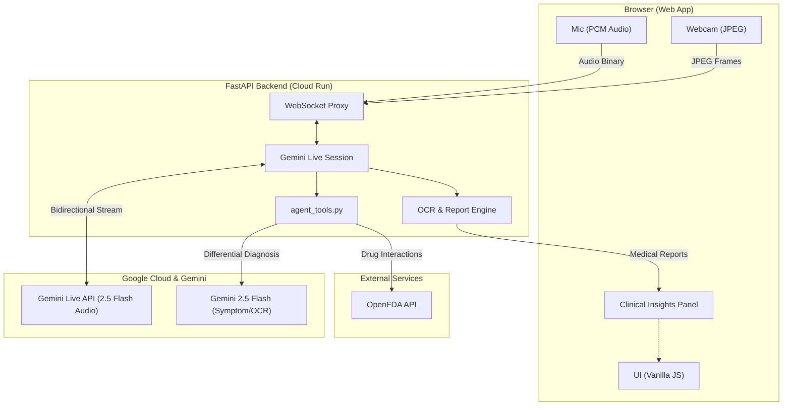

# 🏥 MedsightAI — Real-Time Clinical Decision Assistant

> **Gemini Live Agent Challenge Hackathon** — A multimodal AI assistant that helps doctors analyze patient symptoms during rounds using voice and vision.

[](https://ai.google.dev/gemini-api/docs/live)
[](https://cloud.google.com/run)
[](https://fastapi.tiangolo.com)

---

## 📋 Table of Contents

- [Problem Statement](#-problem-statement)
- [Solution](#-solution)
- [Architecture](#-architecture)
- [Tech Stack](#-tech-stack)
- [Features](#-features)
- [Demo Scenario](#-demo-scenario)
- [Getting Started](#-getting-started)
- [Deploying to Google Cloud](#-deploying-to-google-cloud)
- [Google Cloud Services Used](#-google-cloud-services-used)
- [Hackathon Requirements Checklist](#-hackathon-requirements-checklist)
- [Project Structure](#-project-structure)

---

## 🔍 Problem Statement

During hospital rounds, physicians must rapidly assess patient symptoms, recall drug interactions, reference clinical guidelines, and make critical decisions — often under time pressure with limited access to reference materials. Current tools require manual lookup and switching between multiple systems.

## 💡 Solution

**MedsightAI** is a real-time clinical decision support assistant powered by **Gemini Live API**. A doctor opens the web app and:

1. 🗣️ **Speaks** to the AI assistant naturally
2. 📸 **Shows** symptoms (rash, wound, X-ray) through the webcam
3. 🧠 **AI analyzes** both voice and image inputs in real-time
4. 🔊 **AI responds** with spoken clinical insights
5. ⚡ **Doctor can interrupt** at any time (barge-in support)

The AI provides differential diagnoses, severity assessments, drug interaction checks, and clinical guideline references — all through a natural voice conversation.

---

## 🏗️ Architecture



---

## 🛠️ Tech Stack

| Layer | Technology |
|-------|-----------|
| **AI Model** | Gemini 2.5 Flash (Native Audio Dialog) |
| **Live API** | Gemini Live API (WebSocket, real-time multimodal) |
| **SDK** | Google GenAI Python SDK (`google-genai`) |
| **Backend** | Python 3.11 + FastAPI + Uvicorn |
| **Frontend** | Vanilla JS + Web Audio API + MediaDevices API |
| **Styling** | Custom CSS (Dark Medical Theme) |
| **Deployment** | Google Cloud Run |
| **Container** | Docker |
| **CI/CD** | Google Cloud Build |

---

## ✨ Features

### Multimodal Interaction
- 🎤 **Voice input** — speak naturally to the AI
- 📹 **Webcam video** — show symptoms, X-rays, wounds
- 🔊 **Voice output** — AI responds with natural speech
- ⚡ **Barge-in** — interrupt the AI at any time

### 🚀 The "Beyond Text" Factor
This project breaks the "text box" paradigm. It acts as a **true Live Agent** for clinical environments where hands are often sterilized or busy. The interaction is fully natural:
- The agent "Sees, Hears, and Speaks" via Gemini's multimodal Live API.
- Interruptions (barge-in) are handled gracefully (e.g., "Wait, they are allergic to penicillin").
- Seamlessly weaves real-time video observation with medical fact-checking.

### Clinical Agent Tools
- 🔬 **Symptom Analysis** — differential diagnoses from visual observation via Gemini Vision.
- 💊 **Drug Interactions** — safety checks leveraging the **OpenFDA API**.
- 📋 **Clinical Guidelines** — evidence-based treatment protocols for 12+ major conditions.
- ⚠️ **Risk Assessment** — validated **NEWS2** (National Early Warning Score 2) calculation.
- 📄 **Prescription OCR** — Multi-modal insight from handwritten medical slips.
- 🖨️ **Automated PDF Reports** — summarized clinical prescriptions generated from live audio transcripts.

### Premium UI
- 🌙 Dark medical theme with glassmorphism.
- 💬 Concurrent streaming bubbles for Doctor & AI transcripts.
- 🖨️ Optimized print stylesheets for medical letterhead export.

---

## 🎬 Demo Scenario

### Scene 1: Visual Symptom Analysis

> **Doctor** opens MedsightAI and points the webcam at a rash.
>
> **Doctor**: *"MedsightAI, what do you think about this rash on the patient's forearm?"*
>
> **MedsightAI**: *"I can see what appears to be an erythematous, raised rash on the forearm. Let me run an analysis..."*
>
> The Clinical Insights panel populates with:
> - **Contact Dermatitis** — 75% confidence
> - **Cellulitis** — 60% confidence
> - Recommended tests: Skin biopsy, CBC, IgE levels

### Scene 2: Drug Interaction Check (Interruption)

> **Doctor** interrupts: *"Wait — the patient is allergic to penicillin. What antibiotics are safe?"*
>
> MedsightAI immediately stops speaking and responds:
>
> **MedsightAI**: *"Given the penicillin allergy, amoxicillin is contraindicated. Safe alternatives include azithromycin, doxycycline, or trimethoprim-sulfamethoxazole..."*

---

## 🚀 Getting Started

### Prerequisites

- Python 3.11+
- A [Google AI Studio API key](https://aistudio.google.com/apikey)

### 1. Clone the repository

```bash
git clone https://github.com/YOUR_USERNAME/medsight-ai.git
cd medsight-ai
```

### 2. Set up the backend

```bash
cd backend

# Create virtual environment
python -m venv .venv
source .venv/bin/activate  # macOS/Linux

# Install dependencies
pip install -r requirements.txt

# Set your API key in .env
cp .env.example .env
```

### 3. Run locally

```bash
python main.py
```

Navigate to **http://localhost:8000** in your browser.

---

## ☁️ Deploying to Google Cloud

### Prerequisites

- [Google Cloud SDK](https://cloud.google.com/sdk/docs/install) installed
- A GCP project with billing enabled

### Deploy with the script

```bash
export GEMINI_API_KEY=your_key_here
chmod +x infrastructure/deploy.sh
./infrastructure/deploy.sh my-project-id us-central1
```

---

## ✅ Hackathon Requirements Checklist

| Requirement | Status | Implementation |
|-------------|--------|---------------|
| Uses a Gemini model | ✅ | `gemini-2.5-flash-native-audio-latest` |
| Uses Gemini Live API | ✅ | Real-time WebSocket session via `google-genai` SDK |
| Uses Google Cloud service | ✅ | Cloud Run, Cloud Build, Artifact Registry |
| Multimodal interaction | ✅ | Voice + Vision + Images + AI speech output |
| Supports interruption | ✅ | Built-in Gemini Live API barge-in support |
| Backend on Google Cloud | ✅ | Deployed on Cloud Run |

---

## 📁 Project Structure

```
medsight-ai/
├── backend/
│   ├── main.py              # FastAPI server
│   ├── gemini_live.py        # Gemini Live API wrapper
│   ├── agent_tools.py        # Clinical reasoning tools (NEWS2, OpenFDA)
│   ├── requirements.txt      # Python dependencies
├── frontend/
│   ├── index.html            # Main web page
│   ├── css/styles.css        # Premium dark theme
│   └── js/                   # WebSocket & Media handlers
├── prompts/
│   └── system_prompt.txt     # Clinical system prompt
├── infrastructure/           # Cloud Run & Build configs
├── Dockerfile                # Container definition
└── README.md
```

---

## ⚖️ Disclaimer

MedsightAI is a **demonstration project** built for the Gemini Live Agent Challenge hackathon. It is **not** a certified medical device and should **not** be used for actual clinical decision-making.

---

<p align="center">
  Built with ❤️ for the <strong>Gemini Live Agent Challenge</strong><br>
  Powered by <strong>Google Gemini</strong> and <strong>Google Cloud</strong>
</p>
